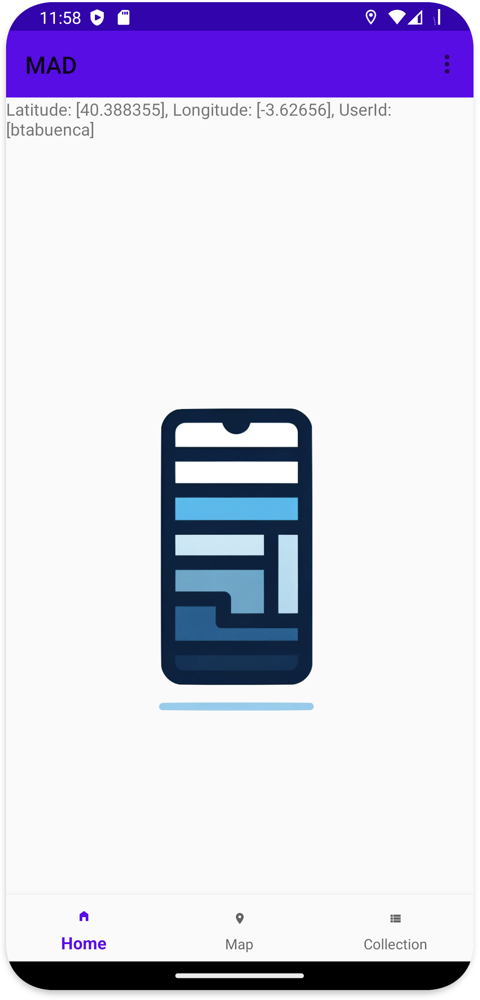
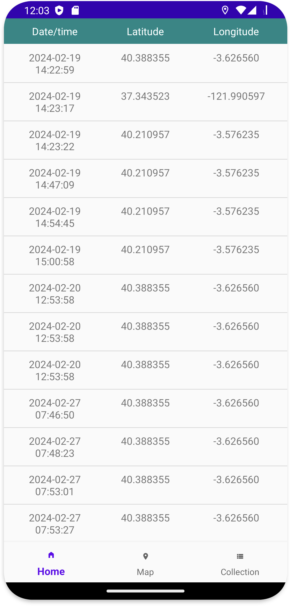
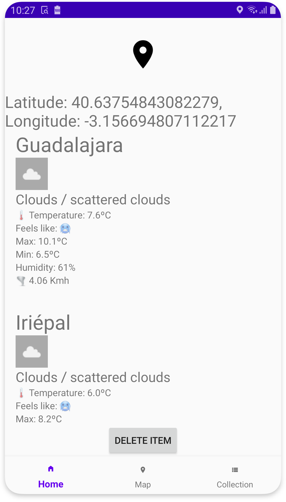
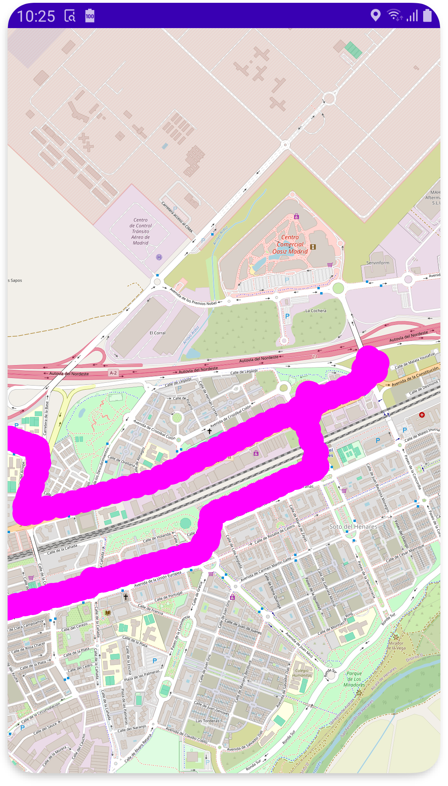
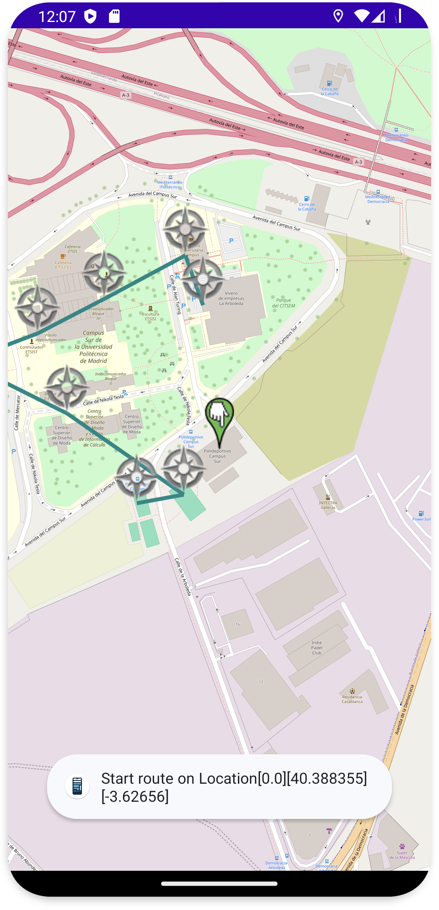
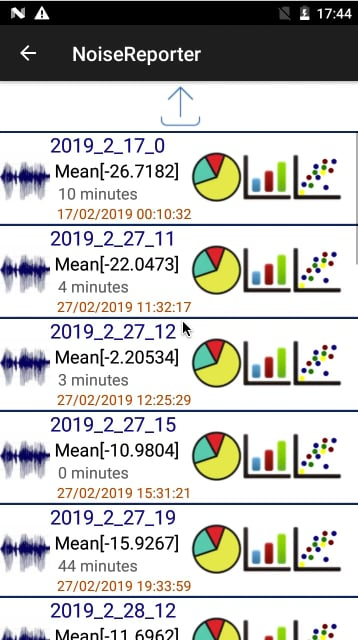

# Your App's Name (e.g., MADTracking)

## Workspace
List of MAD developers:
- Name SecondName Member1 (emailmemmber1@alumunos.upm.es) 
- Name SecondName Member1 (emailmemmber1@alumunos.upm.es)

Github:  
- Repository: https://github.com/btabuenca/HelloWorldKt/   
- Releases: https://github.com/btabuenca/HelloWorldKt/releases   

Workspace: https://upm365.sharepoint.com/sites/MobileAppSite .  
Workload distribution between members: (Percentage member1 / Percentage member 2) . Please only specify in case of unevenly balanced workload distribution e.g., (60%/40%).  

## Description
A brief introduction to what your app does and why it's useful. Explain how it enhances the experience within its scope (e.g., finding green routes to walk in Madrid) and any unique features it offers. Compare and contrast with already existing apps in the markets (Google Play or AppStore iOS).

## Screenshots and navigation
Include screenshots of the app in action. You can upload the images to GitHub and then reference them here using Markdown or HTML syntax:

<table>
  <tr>
    <td>
      
      <p align="center">Describe here image 1</p>
    </td>
    <td>
      
      <p align="center">Describe here image 2</p>
    </td>
  </tr>
  <tr>
    <td>
      
      <p align="center">Describe here image 3</p>
    </td>
    <td>
      
      <p align="center">Describe here image 4</p>
    </td>
  </tr>
  <tr>
    <td>
      
      <p align="center">Describe here image 5</p>
    </td>
    <td>
    </td>
  </tr>
</table>


## Demo Video
Video demonstrating how the app works (Max 1 video of 1 minute), upload it to a platform like YouTube or Vimeo (it might also work with Stream) and link it here:
[](https://vimeo.com/410664338?share=copy)


## Features
List the **functional** features of the app. For example:
- Search for common routes in Madrid.
- Filters by transport type.
- Interactive maps.
- Real-time traffic information.

List the **technical** features of the app. For example:
- Persistence in csv/text file
- Persistence in shared preferences
- Persistence in Room database
- Firebase Realtime database
- Firebase authentication
- Maps: Openstreetmaps or Google maps
- Resful APIs used (Openwheathermaps)
- Menu: *e.g., Toolbar*
- Images: *e.g. glide or picasso library*
- Sensors: *e.g., GPS coordinates, noise meter, light meter, compass, gyroscope, ...* 
- ...

## How to Use
Provide instructions on how to get started with the app. Include code examples or commands that users need to execute if possible.

## Installation
Detail the steps for installing the app, including any dependencies or prerequisites.

```bash
commands to install the app
